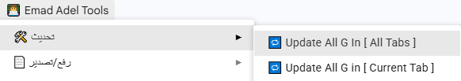

## سكربت تعريب الألعاب باللغة العربية مع دعم التشكيل

سكريبت مخصص لمعالجة وتعريب نصوص الألعاب إلى اللغة العربية مع دعم:

 - إصلاح اتجاه النص RTL
 - تشكيل الحروف العربية تلقائيًا
 - دعم أكواد الألعاب (~n~, ~r~, إلخ)
 - تقسيم الأسطر تلقائيًا او حسب رغبتك

 شرح الاستخدام:

### قم بتعديل سكربت ``auto.gs`` حسب رغبتك

```
  const newline = "~n~"; // قم باضافة سطر جديد من خلال اضافة كود السطر الجديد الخاص باللعبة

  //أول صف يبدأ منه التحديث (يبدأ من الصف الثالث)
  const startRow = 3;

  //رقم عمود اخراج النص النهائي المعكوس (يبدأ من العمود السابع)
  const outputCol = 7; 

  //عدد الدفعات المستخدمة لتقسيم المعالجة
  const numBatches = 3; 
```

